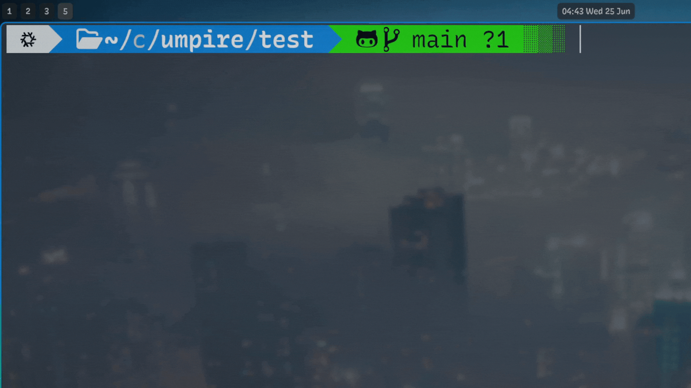

<br />
<div align="center">
  <h1 align="center">Umpire</h1>
  <p align="center">
    ⚖️ Turn testing into your winning edge!
    <br />
    <br />
    
    
    
  </p>
</div>

## ⭐️ About
> Say goodbye to annoying manual test runs during an intense programming contest!

Umpire is a blazingly fast command-line helper that compiles your code, executes it, and automatically validates against all test cases.

With just one short command, you can get quick, clear, and easy-to-read results at a glance. It lets you focus on solving problems rather than wasting time juggling with annoying copy-pastes and loads of commands. 

**Umpire turns testing into your winning edge!**



## 📥 Installation (Linux and MacOS)
Umpire is available for both Linux and MacOS. 
> [!NOTE]
> To avoid large package size, please install the compilers that you use:
> ```sh
> gcc # C++, installed by default
> python3 # Python
> go # Golang
> zulu # Java
> rustc # Rust
> ```
### ❄️ Nix (Linux and MacOS)

<details>
  <summary>Click here to see the installation guide</summary>
  <br>
  Umpire is available via Nix flakes. Please enable Nix flakes for your system (here is the doc that explains how to enable it: <a href="https://nixos.wiki/wiki/Flakes">NixOS Wiki</a>). 

  <br>
  <br>
  
  1. Add the url to your <code>flake.nix</code> input:
  <pre lang="nix">inputs = {
  umpire.url = "github:udontur/umpire";
  # ...
};</pre>
  
  2. Add the package in <code>environment.systemPackages</code>:
  <pre lang="nix">environment.systemPackages = with pkgs; [
  inputs.umpire.packages."${system}".default
  # ...
];</pre>
  3. Rebuild your configuration with Nix flakes enabled.
  <pre lang="sh">sudo nixos-rebuild switch --flake /PATH/TO/CONFIG#WORKSTATION_NAME</pre>
</details>

### 🔵 Arch Linux (AUR)
Use an AUR helper of your choice to get Umpire (like `yay` or `paru`):
```sh
yay -S umpire
```
### 🐧 Other Linux Distros
Run the following command in your terminal:
```sh
git clone https://github.com/udontur/umpire && cd umpire && sudo chmod +x asset/install.sh && asset/install.sh
```
See the [detailed explaination](https://github.com/udontur/umpire/blob/main/docs/install.md).

## 🖥️ Usage
The usage guide is also available via the following command: `um --help`

### 📁 Folder Structure
Organize your code directory as follows:
```sh
task-a # The folder that stores everything
└─ main.cpp # File name must be "main"
   └─ testcase # Exact name
      ├─ ABC.in # Same input / output name: ABC
      ├─ ABC.out # Same input / output name: ABC
```

<details>
  <summary>Click here for more details</summary><br />
<code>task-a</code> is the directory that contains the code file and test case folder.

The code file should be named as <code>main.XXX</code> where <code>XXX</code> is the file extension (<code>.cpp</code> for C++).

The test cases should be located in the <code>testcase</code> folder (must be the **exact name**).

Each test case in the folder must be in the format of <code>ABC.in</code> and <code>ABC.out</code> where <code>ABC</code> is the input / output file name.
</details>

### 🧠 Running Umpire
Run `umpire` in the **current** directory:
```sh
um
```
Or specify a directory:
```
um task-a
```
> [!NOTE]
> For Java programmers, make sure the class name is `main`.
> 
### ⚙️ Options for Umpire
#### 1. Execution time limit
Set the execution time limit in seconds (accepts integers and decimal numbers):
```sh
um -t 3.5 # 3.5 seconds time limit
```
> [!TIP]
> Omit for a 1 second time limit
> ```
> um
> ```

### 💡 Example
Run the code located in the `task-a` folder with a 2 second time limit:
```sh
um task-a -t 2
```  
