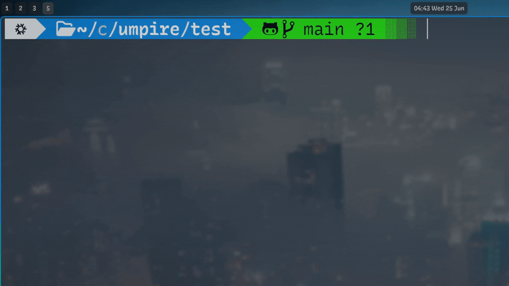

# ⚖️ Umpire

Umpire is a quick and intuitive TUI tool that eliminates all the hassle for testing your code in competitive programming. 

All you need to do is input your test case once, layout your folder structure, and umpire will take it from there!

> **Umpire turns testing into your winning edge!**



## Installation
Umpire is available for both Linux and MacOS.
> [!NOTE]
> To avoid large package size, please install the compilers that you use:
> ```sh
> gcc # C++, installed by default
> python3 # Python
> go # Golang
> zulu # Java
> rustc # Rust
> ```
### Nix (Linux and MacOS)
Umpire is available via Nix flakes.
```
inputs.umpire.packages."${system}".default
```

### AUR (Arch Linux)
Use an AUR helper of your choice to get Umpire (like `yay` or `paru`):
```sh
yay -S umpire
```
### Other Linux Distros
Run the following command in your terminal:
```sh
git clone https://github.com/udontur/umpire && cd umpire && sudo make install
```

## Usage
See all details in the [documentations](./docs/run.md).

### Prerequisite
Organize your code directory as follows:
```sh
task-a/ # The folder that stores everything
└─ main.cpp # File name must be "main"
└─ testcase # Exact name
  ├─ ABC.in
  ├─ ABC.out 
```

### Running Umpire
Run `umpire` in the **current** directory:
```sh
um
```
Or specify a directory:
```
um task-a
```


## License
MIT License - See [LICENSE](./LICENSE) for details.
